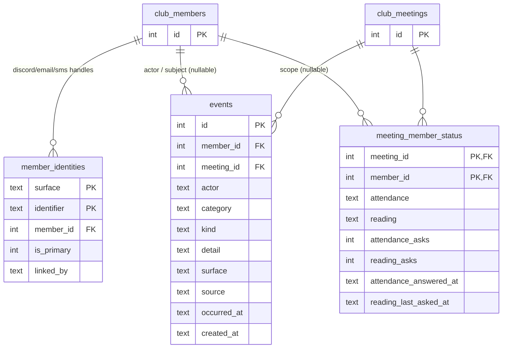
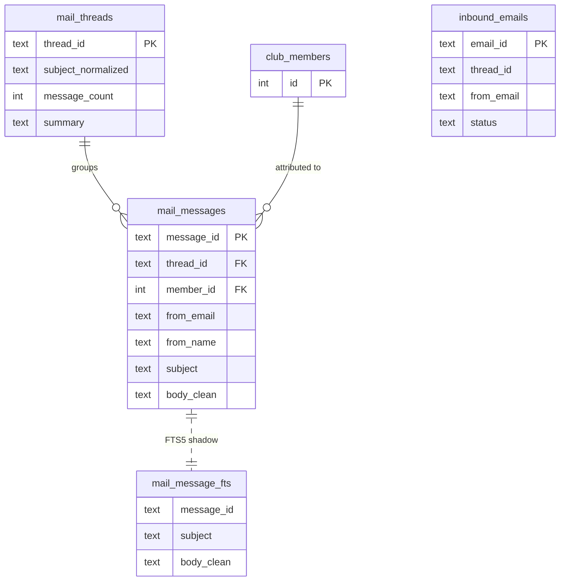

# Oliver's database — ERD

Entity-relationship reference for `agent/oliver.db` (SQLite). Generated by introspecting the live
schema on 2026-06-27 (38 physical tables; the 6 `mail_message_fts*` tables are one FTS5 virtual
table + its shadows, shown here as one node).

The database holds **two classes** of data (see `agent/docs/ROADMAP.md`):

- **Class A — canonical club record** (`club_*` tables): books, authors, meetings, members, reviews,
  awards. Integer surrogate PKs, real foreign keys, `ON DELETE CASCADE` within the core. The Git
  corpus (`corpus/data/`) and the website are **generated** from these tables — they are the source
  of truth. External data lives in 1:1 `*_enrichment` sidecars the enrichment loop owns exclusively.
- **Class B — Oliver's private operational state**: member identity links, conversation history +
  summaries, the email/Discord mail archive, meeting operations (attendance, reading, roll call,
  contacts), durable memories, reminders, proposals, usage + activity logs.

**One member identity.** `club_members` is the single record of a person (`is_current` = active/
inactive); `member_identities` holds that person's handles — `(surface, identifier) → member_id`,
`surface ∈ {discord, email, sms}` — and **every** member-referencing table FKs to `club_members(id)`.
There is no separate participant/claims identity store.

Foreign keys **are enforced at runtime** — `db.connect()` sets `PRAGMA foreign_keys=ON` (the `OFF`
toggles in `db.py` are inside guarded table-rebuild migrations). `club_*` relationships cascade on
delete; the Class-B tables that reference the club record use `NO ACTION` (members are retired with
`is_current=0`, never deleted, so their operational history is preserved).

> Rendering: GitHub and VS Code (Mermaid preview) render the diagrams below inline.

**Legend** — `PK` primary key · `FK` foreign key · `||--o{` one-to-many · `||--o|` one-to-(zero-or-)one ·
associative (join) tables carry a composite PK of two FKs and represent a many-to-many.

---

## 1. Class A — canonical club record

```mermaid
erDiagram
    club_books          ||--o{ club_book_authors  : "written by"
    club_authors        ||--o{ club_book_authors  : "wrote"
    club_books          ||--o{ club_book_pickers  : "picked by"
    club_members        ||--o{ club_book_pickers  : "picks"
    club_meetings       ||--o{ club_meeting_books : "discusses"
    club_books          ||--o{ club_meeting_books : "discussed at"
    club_meetings       ||--o{ club_meeting_hosts : "hosted by"
    club_members        ||--o{ club_meeting_hosts : "hosts"
    club_books          ||--o{ club_reviews       : "reviewed in"
    club_members        ||--o{ club_reviews       : "writes"
    club_awards         ||--o{ club_award_books   : "honors"
    club_books          ||--o{ club_award_books   : "honored by"
    club_awards         ||--o{ club_award_voters  : "voted by"
    club_members        ||--o{ club_award_voters  : "votes in"
    club_books          ||--o| club_book_enrichment   : "enriched 1:1"
    club_authors        ||--o| club_author_enrichment : "enriched 1:1"

    club_books {
        int id PK
        text slug
        text title
        text subtitle
        text topic
        int fiction
        int publication_year
        text isbn13
        text ol_key
        text synopsis
    }
    club_authors {
        int id PK
        text slug
        text name
        text bio
    }
    club_members {
        int id PK
        text slug
        text name
        int is_current
        text website
    }
    club_meetings {
        int id PK
        text date  "nullable"
        text start_time
        text location
        int placeholder
    }
    club_reviews {
        int id PK
        int book_id FK
        int member_id FK
        int rating
        int dnf
        int discussion_quality
        text airtable_id  "vestigial"
    }
    club_awards {
        int id PK
        text name
        int year
        text award_category
    }
    club_book_authors {
        int book_id PK,FK
        int author_id PK,FK
        int ordinal
    }
    club_book_pickers {
        int book_id PK,FK
        int member_id PK,FK
        int ordinal
    }
    club_meeting_books {
        int meeting_id PK,FK
        int book_id PK,FK
        int ordinal
    }
    club_meeting_hosts {
        int meeting_id PK,FK
        int member_id PK,FK
        int ordinal
    }
    club_award_books {
        int award_id PK,FK
        int book_id PK,FK
    }
    club_award_voters {
        int award_id PK,FK
        int member_id PK,FK
    }
    club_book_enrichment {
        int book_id PK,FK
        real ratings_average
        int ratings_count
        int edition_count
        text wikidata_id
        text enriched_at
    }
    club_author_enrichment {
        int author_id PK,FK
        int birth_year
        int death_year
        text nationality
        text wikidata_id
        text enriched_at
    }
```

**Notes.** *picker* (who chose the book, `club_book_pickers`) and *host* (who ran the meeting,
`club_meeting_hosts`) are deliberately distinct M:N relationships — usually the same person, modeled
independently. Books↔meetings is M:N (`club_meeting_books`) for the rare two-books-one-meeting case.
`*_enrichment` are 1:1 sidecars (PK = the parent's id, `CASCADE`) regenerable by `agent/enrich/`.

---

## 2. Class B — identity + the event log / status projection

Meeting operations are event-sourced: one append-only `events` log (the club's **timeline**) plus a
`meeting_member_status` current-state **projection**, both written atomically by `db.record_event`.
This replaced the four entangled tables (`meeting_attendance`, `reading_statuses`, `member_contacts`,
`roll_calls`) — see `migrate_meeting_events`. `events` carries nullable `member_id` **and** `meeting_id`,
so the same table holds meeting-ops (both ids), member-life events (member only), and club happenings
(neither); a `category` groups the free-form `kind` (taxonomy in the build plan). `occurred_at` is when
it happened/will happen (future meetings sit at the right point); `created_at` is when it was recorded.
The projection is sparse — a missing row, or `attendance='unknown'`, means "pending / keep asking".
`club_members` / `club_meetings` are shown trimmed (full attributes in §1).

---

## 3. The mail / discussion archive

The searchable Google-Groups + Discord email history. Each message is attributed to a member by
`mail_messages.member_id` (FK → `club_members`, resolved through `member_identities`) — the single
identity model; there is no separate participant store. `mail_message_fts` is an FTS5 index over
`mail_messages` (not a foreign key). `inbound_emails` is a processing ledger (loosely keyed by id).

---

## 4. Unlinked local state (no foreign keys)

Per-channel / per-message Discord state, keyed by Discord/channel/message id strings (not FKs into
the club record by design — these are operational and disposable).

| Table | Key | Purpose |
|---|---|---|
| `conversations` | `id` (idx `channel_id`) | Rolling per-channel turn history (user + assistant rows). |
| `channel_summaries` | `channel_id` | Rolling summary + `last_id` watermark per channel. |
| `responses` | `message_id` | Dedup guard: "have I already answered this message?" (+ audit of Q/A). |
| `feedback` | `id` | 👍/👎 reactions on Oliver's replies (`message_id`, `reaction`). |
| `memories` | `id` | Durable notes Oliver learns (`scope`, `subject`, `note`, `status`). |
| `reminders` | `id` | Scheduled one-off reminders (`due_at`, `fired_at`). |
| `proposals` | `id` | Staged admin-review actions (`kind`, `status`). |
| `notifications_sent` | `key` | Scheduler dedup keys (e.g. `topic-email-{meetingKey}`). |
| `activity_events` | `id` | Outbound activity-log queue → the Oliver-log webhook. |
| `usage_log` | `id` | Per-turn token/cost accounting (`model`, tokens, `rounds`). |

---

## Issues worth addressing

Ranked by value. None are urgent at the current scale (5 active members, ~180 books, ~2.4k archived
messages); these are about preventing future drift and tidying retired-system residue.

### Resolved (2026-06-27 — member-identity consolidation)

1. ~~**Two parallel "email → member" mappings.**~~ **Done.** The mail archive's `mail_participants` /
   `mail_participant_addresses` store was **removed**; `member_identities` is the single source, and
   the archive attributes via `mail_messages.member_id` resolved through it. `mail_archive.reattribute_archive()`
   re-derives historical attribution when a handle is linked/changed.
2. ~~**`mail_messages` two paths to the member.**~~ **Done.** `sender_participant_id` was dropped;
   `mail_messages.member_id` is the only member link.
5. ~~**Missing FK-column indexes.**~~ **Done.** Added `idx_attendance_member`,
   `idx_reading_statuses_member`, `idx_member_contacts_member`. Also removed `identity_claims` (a dead
   write-only staging table) and added an `sms` member-handle surface. *(The attendance/reading/contact
   tables those indexes covered were since folded into `events`; see below.)*

### Refactored (2026-06-27 — event-sourced meeting ops)

- **The four meeting-ops tables** (`meeting_attendance`, `reading_statuses`, `member_contacts`,
  `roll_calls`) were collapsed into one append-only **`events`** log + a **`meeting_member_status`**
  projection (§2), written atomically by `db.record_event`. "Where do we stand?" is now one projection
  read and "have I already asked Jamie?" is `attendance_asks` on his row; the timeline also records
  group cadence actions (roll-call open/close, week reminder, 2-day briefing) and future events
  (`meeting_scheduled` at the meeting date). Migration: `migrate_meeting_events` seeds the projection
  from the old status rows, backfills event history (timestamps from the source rows), then drops the
  four tables. Phase 2 will mine the email archive into the same timeline.

### Removed (2026-06-27 — member privacy)

- **Email open-tracking** (`email_tracking` + `email_opens` tables, the open-pixel, the Tinylytics
  email poller). Oliver no longer records whether members open emails. Website Tinylytics
  (analytics + kudos) is unrelated and stays. The outbound-contact log that recorded sent/failed
  asks was folded into the `events` log (see Refactored, above).

### Re-classified — not issues

3. **`club_reviews.airtable_id` is NOT vestigial.** It is the review's **stable public id** (the corpus
   `id`, see `corpus_gen`), preserved across edits and asserted by tests. Kept; the column comment was
   corrected. New reviews mint a `rev_<uuid>`, not an Airtable key.

### Low (deferred)

4. **`club_meetings.date` is nullable.** The corpus build and the `/meetings.ics` feed assume a date,
   but **0 rows are null today** and the readers tolerate null, and `NOT NULL` needs a table rebuild
   for a pure tightening. Deferred; a write-time guard in the offline importer is the cheap option.

6. **`responses` vs `conversations` naming.** `responses` is a dedup/idempotency guard, not a second
   history table — the name invites confusion. *Recommend:* a one-line comment (or rename to
   `answered_messages`) to make the role obvious. (Low value; rename forces a migration.)

7. **No retention policy on append-only logs.** `conversations`, `usage_log`, `activity_events`
   only grow. Fine at 20 MB today (the archive dominates); worth a periodic prune/rollup
   eventually (`channel_summaries` already folds old `conversations`, so a matching delete is the
   natural next step).

### Healthy (no action)

- FKs are enforced (`PRAGMA foreign_keys=ON`), with `CASCADE` in the club core and `NO ACTION` on
  operational tables matching the "soft-retire members, keep their history" model.
- The 1:1 enrichment sidecars cleanly isolate regenerable external data from the curated core.
- The ops tables were migrated to integer FKs (the `(meeting_key, member_slug)`-keyed era is gone),
  verified with `PRAGMA foreign_key_check`.
