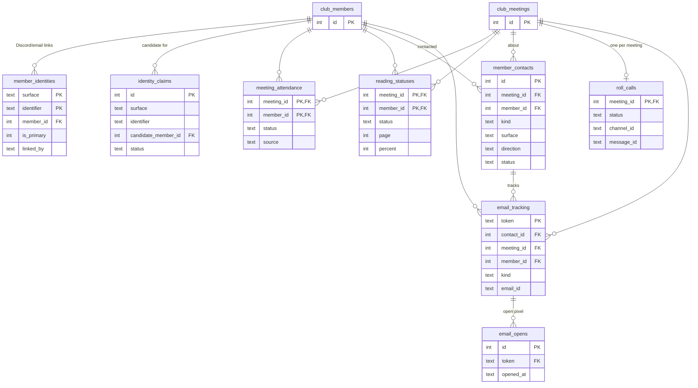
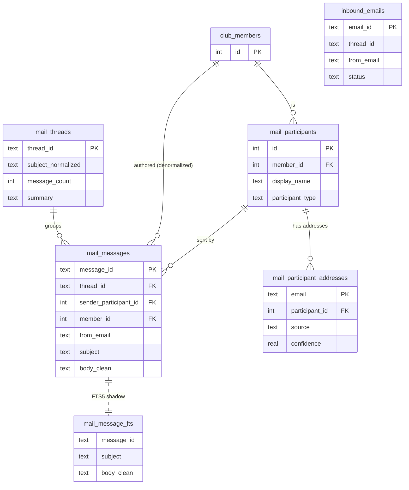

# Oliver's database — ERD

Entity-relationship reference for `agent/oliver.db` (SQLite). Generated by introspecting the live
schema on 2026-06-27 (43 physical tables; the 6 `mail_message_fts*` tables are one FTS5 virtual
table + its shadows, shown here as one node).

The database holds **two classes** of data (see `agent/docs/ROADMAP.md`):

- **Class A — canonical club record** (`club_*` tables): books, authors, meetings, members, reviews,
  awards. Integer surrogate PKs, real foreign keys, `ON DELETE CASCADE` within the core. The Git
  corpus (`corpus/data/`) and the website are **generated** from these tables — they are the source
  of truth. External data lives in 1:1 `*_enrichment` sidecars the enrichment loop owns exclusively.
- **Class B — Oliver's private operational state**: member identity links, conversation history +
  summaries, the email/Discord mail archive, meeting operations (attendance, reading, roll call,
  contacts, email tracking), durable memories, reminders, proposals, usage + activity logs.

Foreign keys **are enforced at runtime** — `db.connect()` sets `PRAGMA foreign_keys=ON` (the `OFF`
toggles in `db.py` are inside guarded table-rebuild migrations). `club_*` relationships cascade on
delete; the Class-B tables that reference the club record use `NO ACTION` (members are retired with
`is_current=0`, never deleted, so their operational history is preserved).

> Rendering: GitHub and VS Code (Mermaid preview) render the diagrams below inline.

**Legend** — `PK` primary key · `FK` foreign key · `||--o{` one-to-many · `||--o|` one-to-(zero-or-)one ·
associative (join) tables carry a composite PK of two FKs and represent a many-to-many.

---

## 1. Class A — canonical club record

```mermaid
erDiagram
    club_books          ||--o{ club_book_authors  : "written by"
    club_authors        ||--o{ club_book_authors  : "wrote"
    club_books          ||--o{ club_book_pickers  : "picked by"
    club_members        ||--o{ club_book_pickers  : "picks"
    club_meetings       ||--o{ club_meeting_books : "discusses"
    club_books          ||--o{ club_meeting_books : "discussed at"
    club_meetings       ||--o{ club_meeting_hosts : "hosted by"
    club_members        ||--o{ club_meeting_hosts : "hosts"
    club_books          ||--o{ club_reviews       : "reviewed in"
    club_members        ||--o{ club_reviews       : "writes"
    club_awards         ||--o{ club_award_books   : "honors"
    club_books          ||--o{ club_award_books   : "honored by"
    club_awards         ||--o{ club_award_voters  : "voted by"
    club_members        ||--o{ club_award_voters  : "votes in"
    club_books          ||--o| club_book_enrichment   : "enriched 1:1"
    club_authors        ||--o| club_author_enrichment : "enriched 1:1"

    club_books {
        int id PK
        text slug
        text title
        text subtitle
        text topic
        int fiction
        int publication_year
        text isbn13
        text ol_key
        text synopsis
    }
    club_authors {
        int id PK
        text slug
        text name
        text bio
    }
    club_members {
        int id PK
        text slug
        text name
        int is_current
        text website
    }
    club_meetings {
        int id PK
        text date  "nullable"
        text start_time
        text location
        int placeholder
    }
    club_reviews {
        int id PK
        int book_id FK
        int member_id FK
        int rating
        int dnf
        int discussion_quality
        text airtable_id  "vestigial"
    }
    club_awards {
        int id PK
        text name
        int year
        text award_category
    }
    club_book_authors {
        int book_id PK,FK
        int author_id PK,FK
        int ordinal
    }
    club_book_pickers {
        int book_id PK,FK
        int member_id PK,FK
        int ordinal
    }
    club_meeting_books {
        int meeting_id PK,FK
        int book_id PK,FK
        int ordinal
    }
    club_meeting_hosts {
        int meeting_id PK,FK
        int member_id PK,FK
        int ordinal
    }
    club_award_books {
        int award_id PK,FK
        int book_id PK,FK
    }
    club_award_voters {
        int award_id PK,FK
        int member_id PK,FK
    }
    club_book_enrichment {
        int book_id PK,FK
        real ratings_average
        int ratings_count
        int edition_count
        text wikidata_id
        text enriched_at
    }
    club_author_enrichment {
        int author_id PK,FK
        int birth_year
        int death_year
        text nationality
        text wikidata_id
        text enriched_at
    }
```

**Notes.** *picker* (who chose the book, `club_book_pickers`) and *host* (who ran the meeting,
`club_meeting_hosts`) are deliberately distinct M:N relationships — usually the same person, modeled
independently. Books↔meetings is M:N (`club_meeting_books`) for the rare two-books-one-meeting case.
`*_enrichment` are 1:1 sidecars (PK = the parent's id, `CASCADE`) regenerable by `agent/enrich/`.

---

## 2. Class B — identity, meeting operations, email tracking

These reference the club record by integer FK. `club_members` / `club_meetings` are shown trimmed
(full attributes in §1).

---

## 3. The mail / discussion archive

The searchable Google-Groups + Discord email history. `mail_message_fts` is an FTS5 index over
`mail_messages` (not a foreign key). `inbound_emails` is a processing ledger (loosely keyed by id).

---

## 4. Unlinked local state (no foreign keys)

Per-channel / per-message Discord state, keyed by Discord/channel/message id strings (not FKs into
the club record by design — these are operational and disposable).

| Table | Key | Purpose |
|---|---|---|
| `conversations` | `id` (idx `channel_id`) | Rolling per-channel turn history (user + assistant rows). |
| `channel_summaries` | `channel_id` | Rolling summary + `last_id` watermark per channel. |
| `responses` | `message_id` | Dedup guard: "have I already answered this message?" (+ audit of Q/A). |
| `feedback` | `id` | 👍/👎 reactions on Oliver's replies (`message_id`, `reaction`). |
| `memories` | `id` | Durable notes Oliver learns (`scope`, `subject`, `note`, `status`). |
| `reminders` | `id` | Scheduled one-off reminders (`due_at`, `fired_at`). |
| `proposals` | `id` | Staged admin-review actions (`kind`, `status`). |
| `notifications_sent` | `key` | Scheduler dedup keys (e.g. `topic-email-{meetingKey}`). |
| `activity_events` | `id` | Outbound activity-log queue → the Oliver-log webhook. |
| `usage_log` | `id` | Per-turn token/cost accounting (`model`, tokens, `rounds`). |

---

## Issues worth addressing

Ranked by value. None are urgent at the current scale (5 active members, ~180 books, ~2.4k archived
messages); these are about preventing future drift and tidying retired-system residue.

### Medium

1. **Two parallel "email → member" mappings can drift.** The canonical store is `member_identities`
   (`surface='email'`), but the mail archive independently links people to members via
   `mail_participant_addresses.email → mail_participants.member_id`. Nothing keeps them in sync, so an
   address could map to member A in one and B (or none) in the other. *Recommend:* declare
   `member_identities` authoritative and have the mail layer resolve a participant's `member_id`
   **through** it (or add a reconciliation check + a test asserting the two agree).

2. **`mail_messages` has two paths to the member.** Both `mail_messages.member_id` (direct) and
   `sender_participant_id → mail_participants.member_id` exist. Denormalization is fine for query
   speed, but there's no constraint keeping them equal. *Recommend:* pick one as source of truth and
   derive the other in a view/at write time, or add a consistency check so they can't silently
   disagree.

### Low

3. **Vestigial `club_reviews.airtable_id`.** Airtable is retired; this column is dead weight on the
   one table that still carries it. *Recommend:* drop it in a small migration (no code reads it).

4. **`club_meetings.date` is nullable.** The corpus build and the `/meetings.ics` feed assume a date.
   A null-dated meeting is a latent render/feed bug. *Recommend:* `NOT NULL` (placeholders already
   carry an approximate date + the `placeholder` flag), or a validation guard on write.

5. **A few FK columns lack a secondary index.** The composite-PK ops tables are indexed
   *meeting-first* (`meeting_attendance`, `reading_statuses`), and `email_tracking.member_id` /
   `member_contacts.member_id` / `mail_messages.sender_participant_id` have no standalone index — so
   *"everything for member X"* lookups scan. Negligible now; add indexes if those access patterns
   grow.

6. **`responses` vs `conversations` naming.** `responses` is a dedup/idempotency guard, not a second
   history table — the name invites confusion. *Recommend:* a one-line comment (or rename to
   `answered_messages`) to make the role obvious.

7. **No retention policy on append-only logs.** `conversations`, `usage_log`, `activity_events`,
   `email_opens` only grow. Fine at 20 MB today (the archive dominates); worth a periodic prune/rollup
   eventually (`channel_summaries` already folds old `conversations`, so a matching delete is the
   natural next step).

### Healthy (no action)

- FKs are enforced (`PRAGMA foreign_keys=ON`), with `CASCADE` in the club core and `NO ACTION` on
  operational tables matching the "soft-retire members, keep their history" model.
- The 1:1 enrichment sidecars cleanly isolate regenerable external data from the curated core.
- The ops tables were migrated to integer FKs (the `(meeting_key, member_slug)`-keyed era is gone),
  verified with `PRAGMA foreign_key_check`.
